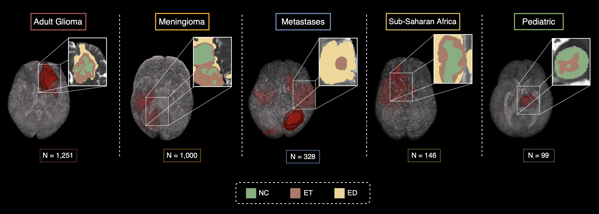
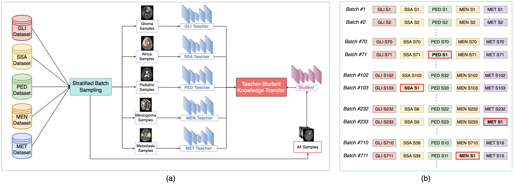
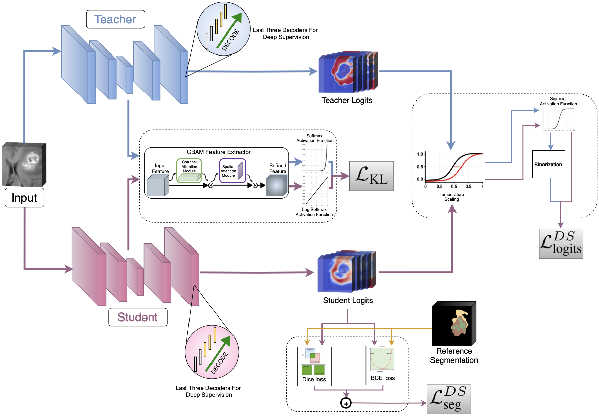
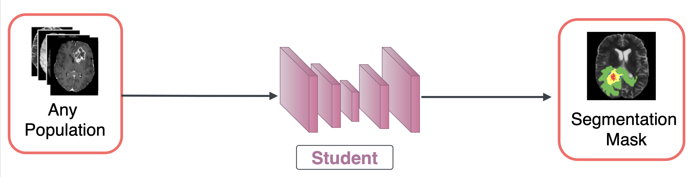

# Advancing Generalizability Across Brain Tumor Populations with Knowledge Distillation

## Project Overview

This project implements a Knowledge Distillation (KD) framework for medical image segmentation, specifically targeting the segmentation of tumors across multiple distinct populations (Adult Glioma, Sub-Saharan African, Pediatric, Meningioma, and Metastatic). The goal is to leverage the knowledge from large, complex "teacher" models, pre-trained on individual tumor types, to train a more compact and efficient "student" model capable of generalizing across all five populations.



The framework is designed for reproducibility and ease of use, incorporating flexible command-line configuration, ClearML for experiment tracking, and organized data/model handling.

## Project Demo
### 🔗 [Watch on YouTube](https://www.youtube.com/watch?v=yBBn2nINEwE)

## Manuscript
### 📄 [Paper Link](https://drive.google.com/file/d/1cwqEfoXRF_o3KiE6mDQVj227MSsWufQA/view)

## Model Architecture
### 1. UNet-based Network


### 2. KD Framework with Stratified Batch Sampling Strategy


### 3. Teacher-Student Knowledge Transfer


### 4. Student Inference


## Project Structure
```
AI/

├── checkpoints/
│ ├── REMOTE_MODEL_SOURCES.md # Information on remote teacher/student model checkpoints
│ ├── student_model/ # Local directory for student model checkpoints
│ └── teacher_models/ # Local directory for teacher model checkpoints
│
├── config/
│ └── default_config.py # Centralized Argparse configuration for all modes
│
├── data/
│ ├── loaders.py # Data loading utilities, including stratified batching
│ └── make_dataset.py # Custom PyTorch Dataset for 3D brain MRI images
│
├── datasets/
│ ├── DATA_SOURCES.md # Information on remote raw dataset sources
│ └── raw/ # Local directory for raw downloaded datasets
│
├── inference/
│ ├── postprocess.py # Utilities for post-processing model outputs
│ ├── predict.py # Core inference logic
│ └── preprocess.py # Utilities for pre-processing input data
│
├── kd_modules/
│ ├── cbam_attention.py # CBAM (Convolutional Block Attention Module) implementation
│ └── framework.py # Knowledge Distillation framework definition
│
├── losses/
│ └── loss.py # Custom loss functions for KD
│
├── models/
│ ├── blocks.py # Building blocks for UNet models
│ ├── dyn_unet.py # Dynamic UNet implementation (MONAI-based)
│ └── model_utils.py # Model utility functions
│
├── notebooks/ # Jupyter notebooks
├── scripts/
│ ├── test.py # Entry point for model testing
│ └── train_kd.py # Entry point for Knowledge Distillation training
│ └── infer.py # Entry point for running inference on single cases
│
├── testing/
│ ├── metrics.py # Metrics calculation for evaluation
│ ├── results/ # Directory for test results (e.g., CSVs)
│ └── test_pipeline.py # Testing pipeline for evaluation
│
├── train_config/
│ ├── optimizer.py # Optimizer initialization
│ └── scheduler.py # Learning rate scheduler initialization
│
├── utils/
│ ├── evaluate.py # Evaluation utilities
│ ├── logger.py # ClearML logging utilities
│ ├── setup_environment.py # Environment setup (seeding, directory creation)
│ ├── training_utils.py # Core training loop utilities
│ └── tsne_visualization.py # t-SNE visualization scripts
│
├── README.md
└── requirements.txt 
```

## Setup and Installation

### Prerequisites

*   Git
*   Python 3.8+
*   CUDA-compatible GPU (version 12.0 or higher)

### 1. Clone the Repository

```bash
git clone https://github.com/AhmeddEmad7/Brain-Tumor-Segmentation-Advancing-Generalizability.git
cd AI
```

### 2. Set up Virtual Environment

It is highly recommended to use a virtual environment to manage dependencies.

```bash
python -m venv venv
source venv/bin/activate # On Windows: .\venv\Scripts\activate
```

### 3. Install Dependencies

Install the required Python packages:

```bash
pip install -r requirements.txt
```

### 4. Configure [ClearML](https://clear.ml) Credentials

#### Option A: Using `clearml-init` (Recommended for first-time setup)

Run the following command in your terminal. It will prompt you for your ClearML API server URL, access key, and secret key. You can find these details on your ClearML server's UI under **Settings -> Workspace -> API Credentials**.

```bash
clearml-init
```
This command will create a `clearml.conf` file in your user's home directory. The content of this file will look similar to this:

```ini
api {
  web_server: https://app.clear.ml/
  api_server: https://api.clear.ml
  files_server: https://files.clear.ml
  credentials {
    "access_key" = "YOUR_ACCESS_KEY"
    "secret_key" = "YOUR_SECRET_KEY"
  }
}
```

#### Option B: Using Environment Variables

Alternatively, you can set the following environment variables.

```bash
export CLEARML_API_SERVER=https://app.clear.ml/
export CLEARML_API_HOST=https://api.clear.ml
export CLEARML_FILES_HOST=https://files.clear.ml
export CLEARML_API_ACCESS_KEY=YOUR_ACCESS_KEY
export CLEARML_API_SECRET_KEY=YOUR_SECRET_KEY
```
Remember to replace the placeholders with your actual ClearML credentials. If you set these in your shell profile (e.g., `.bashrc`, `.zshrc`), they will persist across sessions.

### 5. Download Datasets

The raw medical imaging datasets are too large to host on Git. You need to download them manually.

1.  Refer to `datasets/DATA_SOURCES.md` for download links to the raw population datasets.
2.  After downloading, place each dataset into its corresponding subdirectory within `datasets/raw/`. For example:

    ```
    /datasets/raw/
    │
    ├───GLI_data/
    │      ├──BraTS-GLI-00000-000
    │      │      └──BraTS-GLI-00000-000-t1c.nii.gz
    │      │      └──BraTS-GLI-00000-000-t1n.nii.gz
    │      │      └──BraTS-GLI-00000-000-t2f.nii.gz
    │      │      └──BraTS-GLI-00000-000-t2w.nii.gz
    │      │      └──BraTS-GLI-00000-000-seg.nii.gz
    │      ├──BraTS-GLI-00002-000
    │      │      └──BraTS-GLI-00002-000-t1c.nii.gz
    │      ...    └──...
    │
    ├───SSA_data/
    │        ├──BraTS-SSA-00002-000
    │        │      └──BraTS-SSA-00002-000-t1c.nii.gz
    │        │      └──BraTS-SSA-00002-000-t1n.nii.gz
    │        │      └──BraTS-SSA-00002-000-t2f.nii.gz
    │        │      └──BraTS-SSA-00002-000-t2w.nii.gz
    │        │      └──BraTS-SSA-00002-000-seg.nii.gz
    │        ├──BraTS-SSA-00007-000
    │        │      └──BraTS-SSA-00007-000-t1c.nii.gz
    │        ...    └──...
    │
    ├───PED_data/
    │        ├──BraTS-PED-00002-000
    │        │      └──BraTS-PED-00002-000-t1c.nii.gz
    │        │      └──BraTS-PED-00002-000-t1n.nii.gz
    │        │      └──BraTS-PED-00002-000-t2f.nii.gz
    │        │      └──BraTS-PED-00002-000-t2w.nii.gz
    │        │      └──BraTS-PED-00002-000-seg.nii.gz
    │        ├──BraTS-PED-00003-000
    │        │      └──BraTS-PED-00003-000-t1c.nii.gz
    │        ...    └──...
    │
    ├───MEN_data/
    │        ├──BraTS-MEN-00004-000
    │        │      └──BraTS-MEN-00004-000-t1c.nii.gz
    │        │      └──BraTS-MEN-00004-000-t1n.nii.gz
    │        │      └──BraTS-MEN-00004-000-t2f.nii.gz
    │        │      └──BraTS-MEN-00004-000-t2w.nii.gz
    │        │      └──BraTS-MEN-00004-000-seg.nii.gz
    │        ├──BraTS-MEN-00008-000
    │        │      └──BraTS-MEN-00008-000-t1c.nii.gz
    │        ...    └──...
    │
    ├───MET_data/
            ├──BraTS-MET-00001-000
            │      └──BraTS-MET-00001-000-t1c.nii.gz
            │      └──BraTS-MET-00001-000-t1n.nii.gz
            │      └──BraTS-MET-00001-000-t2f.nii.gz
            │      └──BraTS-MET-00001-000-t2w.nii.gz
            │      └──BraTS-MET-00001-000-seg.nii.gz
            ├──BraTS-MET-00002-000
            │      └──BraTS-MET-00002-000-t1c.nii.gz
            ...    └──...


### 6. Download Pre-trained Teacher/Student Models

The pre-trained teacher models and the initial student model checkpoint are also hosted externally.

1.  Refer to `checkpoints/REMOTE_MODEL_SOURCES.md` for download links to the teacher models checkpoints.
2.  Place the downloaded `.pth` files into their respective directories:
    *   Teacher models go into `checkpoints/teacher_models/` (e.g., `GLI_Teacher_Checkpoint.pth`).
3. The student base model (if used for resuming training) goes into `checkpoints/student_model/` (e.g., `Student_Model_Checkpoint.pth`).

## Usage

### Configuration

All configurable parameters (hyperparameters, paths) are managed in `config/default_config.py`. This file defines the command-line arguments for each mode.

### 1. Training (Knowledge Distillation)

To start the Knowledge Distillation training process:

```bash
python scripts/train_kd.py train [OPTIONS]
```

**Common Training Options:**

*   `--epochs <int>`: Number of training epochs (default: 2).
*   `--train_batch_size <int>`: Batch size for training (default: 5). This is also used for gradient accumulation steps.
*   `--learning_rate <float>`: Initial learning rate (default: 1e-3).
*   `--base_data_dir <path>`: Base directory for raw datasets (default: `datasets/raw/`).
*   `--base_teacher_models_dir <path>`: Base directory for teacher models (default: `checkpoints/teacher_models/`).
*   `--out_checkpoint_dir <path>`: Directory to save student model checkpoints (default: `checkpoints/student_model/`).

**Example:**
```bash
python scripts/train_kd.py train --epochs 50 --learning_rate 0.0001 --train_batch_size 10
```

### 2. Testing (Model Evaluation)

To evaluate a trained student model:

```bash
python scripts/test.py test [OPTIONS]
```

**Common Testing Options:**

*   `--student_model_path <path>`: Path to the student model checkpoint to test (default: `checkpoints/student_model/Final_KD_Student_Model_v2.pth`).
*   `--test_batch_size <int>`: Batch size for testing (default: 1).
*   `--base_data_dir <path>`: Base directory for raw datasets (default: `datasets/raw/`).

**Example:**
```bash
python scripts/test.py test --student_model_path checkpoints/student_model/Student_Model_Checkpoint.pth
```
Test results (e.g., metrics in CSV) will be saved in `testing/results/`.

### 3. Inference (Prediction on New Data)

To perform inference on new 3D NIfTI brain MRI images:

```bash
python scripts/infer.py inference [OPTIONS]
```

**Common Inference Options:**

*   `--inference_model_path <path>`: Path to the model checkpoint for inference.
*   `--t1c_path <path>`: Path to the T1-contrast enhanced NIfTI file (**Required**)
*   `--t1w_path <path>`: Path to the T1-native NIfTI file. (**Required**)
*   `--t2f_path <path>`: Path to the T2-FLAIR NIfTI file. (**Required**)
*   `--t2w_path <path>`: Path to the T2-weighted NIfTI file. (**Required**)
*   `--output_dir <path>`: Directory to save the output prediction mask and preprocessed input volumes (default: `inference/outputs/`).
*   `--device <str>`: Device to run inference on (e.g., `cuda` or `cpu`; default: `cuda`).
*   `--sw_batch_size <int>`: Batch size for sliding window inference (default: 4).
*   `--overlap <float>`: Overlap percentage for sliding window (0.0 to 1.0; default: 0.25).
*   `--sw_mode <str>`: Blending mode for sliding window (`gaussian` or `constant`; default: `gaussian`).
*   **Note:** The `roi_size` for sliding window inference is fixed at `(128, 128, 128)` to work correctly with the student model and cannot be changed via command-line arguments.

**Example:**
```bash
python scripts/infer.py inference \
    --t1c_path /path/to/patient/T1c.nii.gz \
    --t1w_path /path/to/patient/T1w.nii.gz \
    --t2f_path /path/to/patient/T2F.nii.gz \
    --t2w_path /path/to/patient/T2W.nii.gz \
    --output_dir /inference/outputs/ \
    --inference_model_path checkpoints/student_model/Student_Model_Checkpoint.pth
```

## Cloud-based Medical Imaging Platform

**Beyond the core AI functionality, this project is part of a larger initiative that includes the development of a full-fledged medical imaging platform.** This platform is designed to provide a comprehensive solution for medical image viewing, analysis, and management, with deep integration of the AI segmentation model developed here. It offers a rich user interface, advanced visualization capabilities, and streamlined workflows for medical professionals.

For more detailed information about the medical imaging platform, its features, and how to set it up, please refer to the [Medical Imaging Platform README](software/README.md).

## Team Members

Gratitude goes out to all team members for their valuable contributions to this project.

<div align="left">
    <a href="https://github.com/AhmeddEmad7">
    
  </a>
    <a href="https://github.com/hazemzakariasaad">
      
    </a>
    <a href="https://github.com/nourhan-ahmedd">
      
    </a>
    <a href="https://github.com/MariemMagdi">
      
    </a>
    <a href="https://github.com/Mina-A-Tayeh">
      
    </a>
</div>

<!-- ## Citation

If you find this work useful, please consider citing:

```bibtex
@article{emad2025advancing,
  title={Advancing generalizability across brain tumor populations with knowledge distillation},
  author={Emad, Ahmed and Zakariasaad, Hazem and Ahmed, Nourhan and Magdi, Mariem and Tayeh, Mina},
  journal={bioRxiv},
  year={2025},
  publisher={Cold Spring Harbor Laboratory}
}
``` -->

## Contributing

Contributions are welcome! Please feel free to open issues or submit pull requests.
